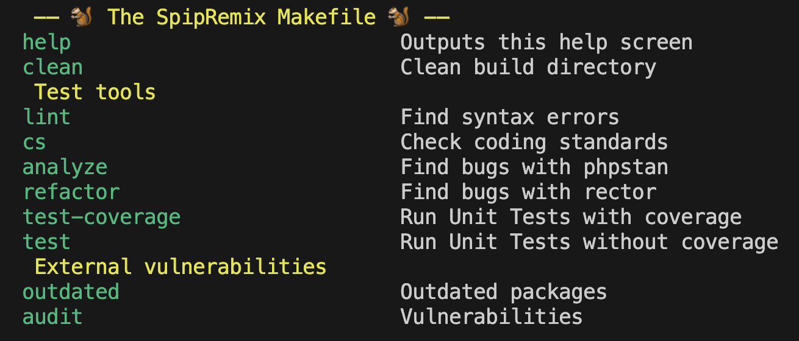

# Friends of SPIP

## Build

```bash
./build.sh
./build.sh apache
./build.sh fpm
```

## Usage

See [Versions](https://hub.docker.com/r/spip/tools/tags)

Locally:

```bash
docker run --rm -v $(pwd):/build/app spip/tools:<version> # Display the commands list
```

Example `docker run --rm -v $(pwd):/build/app spip/tools:8.2`:



```bash
docker run --rm -v $(pwd):/build/app spip/tools:<version> <[command ...]>
```

Example `docker run --rm -v $(pwd):/build/app spip/tools:8.5 clean cs`:

```txt
Checking coding standards ...
make: *** [/Makefile:76: build/ecs.json] Error 2
```

in a `.gitlab-ci.yml`:

```yml
my-job:
    stage: my-stage
    image:
        name: spip/tools:<version>
        entrypoint:
        - "/bin/ash"
        - "-c"
    script:
        - make -f /Makefile <[command ...]>
    artifacts:
        - <build/[file ...]>
```

Custom your own image:

```Dockerfile
FROM spip/tools:<version>
ENV COMPOSER_AUTH="{\"github-oauth\": {\"github.com\": \"xxxxx\"}, \"gitlab-token\": {\"gitlab.my.org\":\"xxxxx\"}}"
COPY <my-tool>.make /build/makefiles
RUN apk --no-cache add openssh git && \
    ssh-keyscan gitlab.my.org > /build/.ssh/known_host && \
    composer config --global gitlab-domains gitlab.my.org
```

```bash
docker run \
    --rm \
    -e SSH_AUTH_SOCK=/ssh-agent \
    -v $(pwd):/build/app \
    -v $SSH_AUTH_SOCK:/ssh-agent \
    your/image:<version> <command>
```

## TODO

### V2

- `phplint.exclude.lst` optional
  - `parallel-lint --exclude src/templates --exclude tests/fixtures src tests`
  - `parallel-lint --exclude "$(cat phplint.exclude.lst)"> $(cat phplint.lst)`
- include /makefiles/*.make
- deptrac
- template config files + check command
- src files hash(js turbo like)
- php/pie

### V3

- "spip-cli"
- "checkout"
